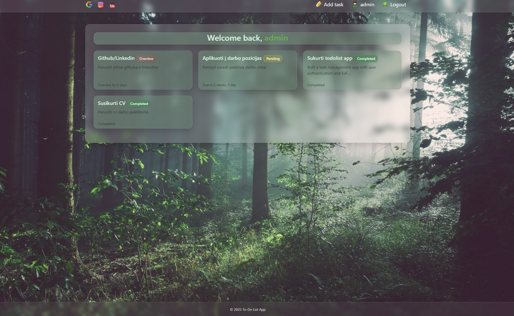
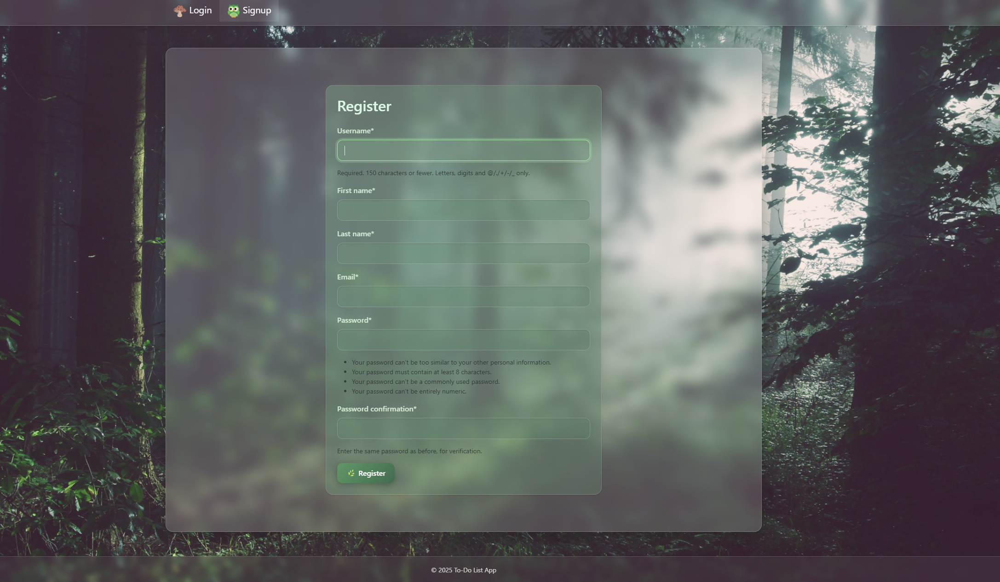

# Todo App with Django

📌 **Full CRUD + User Authentication**  

## 🖼️ Screenshots  
<div align="center">
  
  
</div>

*Vartotojo sąsaja su užduotimis ir registracijos forma*

## 🛠️ Technologies  
- **Backend**: Python 3.11, Django 4.2  
- **Database**: PostgreSQL  
- **Frontend**: HTML5, Bootstrap 5  

## 🔧 Installation  
1. Clone the repository:
```bash
git clone https://github.com/mantas-an/TodoList20250706.git
cd TodoList20250706
